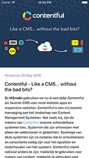
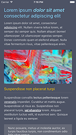
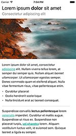

# Marky Mark
[](https://travis-ci.org/M2Mobi/Marky-Mark) [](https://codecov.io/gh/M2Mobi/Marky-Mark)
Marky Mark is a parser written in Swift that converts markdown into native views. The way it looks it highly customizable and the supported markdown syntax is easy to extend.

[](Readme_Assets/example1.png)
[](Readme_Assets/example2.png)
[](Readme_Assets/example3.png)

## Example

To run the example project, clone the repo, and run `pod install` from the Example directory first.

## Requirements
- iOS 8.0+ 
- Xcode 8.0+

## Installation

CocoaPods 1.0.0+ is required to build MarkyMark

To integrate MarkyMark into your Xcode project using CocoaPods, specify it in your `Podfile`:

```ruby
pod "markymark"
```

## Simple usage

### View with default styling
```swift
let markDownView = MarkDownTextView()
markDownView.text = "# Header\nParagraph"
```

### View with modified styling

Markymark has many styling options, please check the examples in the styling section of this readme. A simple example:

```swift
let markDownView = MarkDownTextView()
markDownView.styling.headingStyling.textColorsForLevels = [
	.orange, //H1 (i.e. # Title)
	.black,  //H2, ... (i.e. ## Subtitle, ### Sub subtitle)
]

markDownView.styling.linkStyling.textColor = .blue
markDownView.styling.paragraphStyling.baseFont = .systemFont(ofSize: 14)
markDownView.text = "# Header\nParagraph"
```


## Supported tags in the Default Flavor
Note: Different tags can be supported by either extending the ContentfulFlavor (default) or by implementing a class that comforms to `Flavor` and implement the required `Rule`'s

```
Headings
# H1
## H2
### H3
#### H4
##### H5
###### H6

Lists
- item
	- item
* item
	* item
+ item
	+ item
a. item
b. item
1. item
2. item

Emphasis
*Em*
_Em_
**Strong**
__Strong__
~~Strike through~~

Images


Links
[Link text](https://www.example.net)

Code 
`code`
\```code```
```


### Customizing default style

Default Styling instance

```swift
var styling = DefaultStyling()
```
#### Paragraphs (regular text)
Markdown example: `Some text`

```swift
styling.paragraphStyling.baseFont = .systemFont(ofSize: 14)
styling.paragraphStyling.textColor = .black
styling.paragraphStyling.contentInsets = UIEdgeInsets(top:0, left: 0, bottom: 5, right: 0)  
styling.paragraphStyling.lineHeight = 4
styling.paragraphStyling.isBold = false
styling.paragraphStyling.isItalic = false
styling.paragraphStyling.textAlignment = .left
```

#### Headings

Markdown example: `# Title` or `## Subtitle` etc.

```swift
styling.headingStyling.fontsForLevels = [
	UIFont.boldSystemFontOfSize(24), //H1
	UIFont.systemFontOfSize(18),     //H2
	UIFont.systemFontOfSize(16)      //H3, ... (last item will be next levels as well)
]

styling.headingStyling.colorsForLevels = [
	.red, //H1
	.black, //H2, ... (last item will be next levels as well)
]

// Margins
styling.headingStyling.contentInsetsForLevels = [
	UIEdgeInsets(top: 5, left: 0, bottom: 15, right: 10), // H1
	UIEdgeInsets(top: 5, left: 0, bottom: 5, right: 10) //H2, ... (last item will be next levels as well)
]

styling.headingStyling.isBold = false
styling.headingStyling.isItalic = false
styling.headingStyling.isUnderlined = false
styling.headingStyling.textAlignment = .left
```

#### linkStyling
Markdown Example `[Google](http://www.google.com)`

```swift
styling.linkStyling.textColor = .black
styling.linkStyling.baseFont = nil // Default: nil. Setting baseFont to nil will inherit font from paragraphStyling

styling.linkStyling.isBold = false
styling.linkStyling.isItalic = false
styling.linkStyling.isUnderlined = true
```

#### List styling
Markdown Example:

```
- List item 1
- List item 2
- Nested List item
```

```swift
// By default a font will be used with the bullet character `•`. Use the follow properties to configure it's size and color:
styling.listStyling.bulletFont = .systemFont(ofSize: 14)
styling.listStyling.bulletColor = .black

// Bullets can also be images for more complex styling. When setting images, bullet font and color won't be used anymore
// Array of images used as bullet for each level of nested list items
styling.listStyling.bulletImages = [
	UIImage(named: "circle"),
	UIImage(named: "emptyCircle"),
	UIImage(named: "line"),
	UIImage(named: "square")
]

// Size of the images
styling.listStyling.bulletViewSize = CGSize(width: 16, height: 16)

styling.listStyling.baseFont = .systemFont(ofSize: 14)
styling.listStyling.contentInsets = UIEdgeInsets(top: 0, left:  0, bottom: 10, right: 10)

//Amount of space underneath each list item
styling.listStyling.bottomListItemSpacing = 5

// Number of pixels to indent for each nested list level
styling.listStyling.listIdentSpace = 15

styling.listStyling.textColor = .black
```

Styling is also possible for:

```
styling.paragraphStyling
styling.italicStyling
styling.boldStyling
styling.strikeThroughStyling
styling.imageStyling
styling.linkStyling
styling.horizontalLineStyling
styling.codeBlockStyling
styling.inlineCodeBlockStyling
styling.quoteStyling
```
_Please check the `DefaultStyling` class for more information_


## Advanced usage
Advanced usage is only needed for very specific cases. Making subsets of styling, making different styling combinations, supporting different Markdown rules (syntax) or modifying certain views after that have been generated.

### Custom styling objects

```swift
struct CustomMarkyMarkStyling: Styling {
	var headerStyling = CustomHeaderStyling()
	var paragraphStyling = ParagraphStyling()
	var linkStyling = ListStyling()

	var itemStylingRules: [ItemStyling] {
		return [headerStyling, paragraphStyling, linkStyling]  
	}
}
```

You can implement `CustomHeaderStyling` by checking how other `Styling` objects have been implemented, like ``HeaderStyling`. 
Make sure your `CustomHeaderStyling` comforms to all styling rules you'd like your custom styling to support. i.e. comform to `TextColorStylingRule` to support textStyle of your custom styling.

Each styling rule can be applied to a markDownItem by comforming to `ItemStyling` and implement the required method like this:

```
public func isApplicableOn(_ markDownItem: MarkDownItem) -> Bool {
	return markDownItem is HeaderMarkDownItem
}

```
This will let the mechanism know it should apply your styling to a HeaderMarkDownItem

You can inject your new styling object by passing it to the constructor of the `MarkdownTextView`

```
MarkDownTextView(styling: CustomMarkyMarkStyling())
```

### Adding your own rules
Adding a new rule requires three new classes of based on the following protocol:

* `Rule` that can recoginizes the desired markdown syntax
* `MarkDownItem` for your new element that will be created by your new rule
* `LayoutBlockBuilder` that can convert your MarkDownItem to layout

Add the rule to MarkyMark

```swift
markyMark.addRule(MyCustomRule())
```

Add the block builder to your layout converter

```swift
converter.addLayoutBlockBuilder(MyCustomLayoutBlockBuilder())
```

If needed you can also add a custom styling class to the default styling

```swift
styling.addStyling(MyCustomStyling())
```

### Converter hook
The converter has a callback method which is called every time a `MarkDownItem` is converted to layout. 

```swift
converter.didConvertElement = {
	markDownItem, view in
	// Do something with markDownItem and / or view here
}
```

When using the MarkdownTextView

```swift
markDownTextView.onDidConvertMarkDownItemToView = {
    markDownItem, view in

}
```

### Changing link behavior

By default Markymark opens URL's using `UIApplication.shared.open(url:)`.  Markymark allows changing this behavior by passing a custom URLOpener, an object that comforms to the `URLOpener` protocol.

```swift
let markDownView = MarkDownTextView()
markDownTextView?.urlOpener = MyCustomerURLOpener()
```

### Using Markymark in Extensions

Markymark also supports usage the a Today extension. By default tapping url's is not working, since Extensions don't have access to UIApplication.shared, in order to support links you can pass a different url opener to a MarkyDownTextView. See the Example project for a working example:

```swift
markDownTextView?.urlOpener = ExtensionContextURLOpener(extensionContext: self.extensionContext)
```

## Author

M2mobi, info@m2mobi.com

## License

MarkyMark is available under the MIT license. See the LICENSE file for more info.
